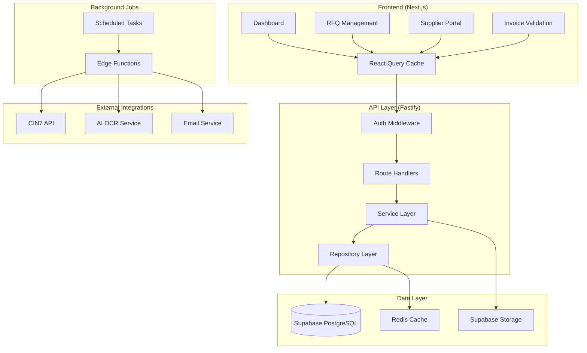

# Arquitetura do Sistema - Order Management & Supplier Portal

## Visão Geral

Este documento define a arquitetura para um sistema SaaS de gestão de pedidos para suprimentos com portal do fornecedor, integrado ao CIN7. O sistema foi projetado para ser **simples, robusto e otimizado** para baixo tráfego (<100 requisições/mês) e poucos usuários, seguindo as melhores práticas de Object Calisthenics e estratégias de cache inteligentes.

## Princípios Arquiteturais

### 1. Simplicidade Robusta
- **KISS (Keep It Simple, Stupid)**: Evitar over-engineering
- **Single Responsibility**: Cada componente tem uma responsabilidade clara
- **Fail Fast**: Detecção precoce de erros com tratamento adequado
- **Convention over Configuration**: Reduzir decisões desnecessárias

### 2. Object Calisthenics Aplicados
- **One level of indentation per method**: Máximo 1 nível de indentação
- **Don't use the ELSE keyword**: Uso de early returns e guard clauses
- **Wrap all primitives and strings**: Value Objects para domínio
- **First class collections**: Collections encapsuladas em classes específicas
- **One dot per line**: Evitar method chaining excessivo
- **Don't abbreviate**: Nomes descritivos e completos
- **Keep all entities small**: Classes com máximo 50 linhas
- **No classes with more than two instance variables**: Foco em coesão
- **No getters/setters/properties**: Comportamento sobre estado

### 3. Cache Strategy
- **Cache Near Data**: Cache próximo aos dados mais voláteis
- **TTL Inteligente**: TTLs baseados na volatilidade dos dados
- **Cache Warming**: Pré-carregamento de dados críticos
- **Invalidação Seletiva**: Invalidação baseada em eventos

## Stack Tecnológico

### Frontend
- **Next.js 14** (App Router)
- **TypeScript** para type safety
- **Tailwind CSS** para styling
- **React Query (TanStack Query)** para cache e state management
- **Zod** para validação de dados
- **React Hook Form** para formulários

### Backend
- **Node.js 20** com **TypeScript**
- **Fastify** como framework web (performance superior ao Express)
- **Supabase** como Backend-as-a-Service
  - PostgreSQL para banco de dados
  - Auth para autenticação
  - Storage para arquivos
  - Edge Functions para integrações
  - Realtime para notificações

### Infraestrutura
- **Vercel** para deploy do frontend
- **Supabase Cloud** para backend services
- **Cloudflare** para CDN e DNS
- **GitHub Actions** para CI/CD

## Arquitetura do Sistema



## Estrutura de Dados e Cache

### Cache Strategy por Entidade

#### 1. SKUs e Estoque (Dados Semi-Voláteis)
```typescript
// TTL: 10 minutos
interface StockCache {
  skuId: string;
  quantity: number;
  reserved: number;
  incoming: number;
  lastUpdated: Date;
  source: 'cin7' | 'cache';
}
```

#### 2. Fornecedores (Dados Estáticos)
```typescript
// TTL: 24 horas
interface VendorCache {
  vendorId: string;
  profile: VendorProfile;
  activeSkus: string[];
  lastUpdated: Date;
}
```

#### 3. RFQs Ativas (Dados Dinâmicos)
```typescript
// TTL: 5 minutos
interface RfqCache {
  rfqId: string;
  status: RfqStatus;
  responses: VendorResponse[];
  lastActivity: Date;
}
```

#### 4. Templates e Arquivos (Dados Imutáveis)
```typescript
// TTL: 7 dias
interface FileCache {
  fileId: string;
  url: string;
  metadata: FileMetadata;
  checksum: string;
}
```

### Implementação do Cache

```typescript
class CacheManager {
  constructor(
    private readonly redisClient: Redis,
    private readonly logger: Logger
  ) {}

  async get<T>(key: CacheKey, fallback: () => Promise<T>): Promise<T> {
    const cached = await this.redisClient.get(key.toString());

    if (cached) {
      this.logger.debug('Cache hit', { key: key.toString() });
      return JSON.parse(cached);
    }

    this.logger.debug('Cache miss', { key: key.toString() });
    const value = await fallback();

    await this.set(key, value);
    return value;
  }

  private async set<T>(key: CacheKey, value: T): Promise<void> {
    const ttl = this.getTtlByKeyType(key.type);
    await this.redisClient.setex(
      key.toString(),
      ttl,
      JSON.stringify(value)
    );
  }

  private getTtlByKeyType(keyType: CacheKeyType): number {
    const ttlMap = {
      stock: 600,      // 10 min
      vendor: 86400,   // 24 horas
      rfq: 300,        // 5 min
      file: 604800,    // 7 dias
      template: 604800 // 7 dias
    };

    return ttlMap[keyType];
  }
}
```

## Arquitetura de Domínio (Object Calisthenics)

### 1. Value Objects

```typescript
class SkuCode {
  constructor(private readonly value: string) {
    this.validate();
  }

  toString(): string {
    return this.value;
  }

  equals(other: SkuCode): boolean {
    return this.value === other.value;
  }

  private validate(): void {
    if (!this.value || this.value.length < 3) {
      throw new InvalidSkuCodeError();
    }
  }
}

class Money {
  constructor(
    private readonly amount: number,
    private readonly currency: Currency
  ) {
    this.validate();
  }

  add(other: Money): Money {
    this.ensureSameCurrency(other);
    return new Money(this.amount + other.amount, this.currency);
  }

  isGreaterThan(other: Money): boolean {
    this.ensureSameCurrency(other);
    return this.amount > other.amount;
  }

  private validate(): void {
    if (this.amount < 0) {
      throw new InvalidAmountError();
    }
  }

  private ensureSameCurrency(other: Money): void {
    if (!this.currency.equals(other.currency)) {
      throw new CurrencyMismatchError();
    }
  }
}
```

### 2. Entidades de Domínio

```typescript
class Rfq {
  constructor(
    private readonly id: RfqId,
    private readonly skuCode: SkuCode,
    private readonly createdBy: UserId,
    private readonly deadline: Deadline,
    private vendors: VendorList,
    private status: RfqStatus
  ) {}

  addVendor(vendor: Vendor): void {
    this.ensureNotClosed();
    this.vendors.add(vendor);
  }

  close(): void {
    this.status = RfqStatus.closed();
  }

  receiveQuote(vendorId: VendorId, quote: Quote): void {
    this.ensureNotClosed();
    this.ensureVendorExists(vendorId);

    const vendor = this.vendors.find(vendorId);
    vendor.submitQuote(quote);

    this.status = RfqStatus.quotesReceived();
  }

  private ensureNotClosed(): void {
    if (this.status.isClosed()) {
      throw new RfqClosedError();
    }
  }

  private ensureVendorExists(vendorId: VendorId): void {
    if (!this.vendors.contains(vendorId)) {
      throw new VendorNotFoundError();
    }
  }
}
```

### 3. Collections como First-Class Citizens

```typescript
class VendorList {
  constructor(private readonly vendors: Vendor[]) {}

  add(vendor: Vendor): void {
    if (this.contains(vendor.id)) {
      throw new DuplicateVendorError();
    }
    this.vendors.push(vendor);
  }

  find(vendorId: VendorId): Vendor {
    const vendor = this.vendors.find(v => v.id.equals(vendorId));
    if (!vendor) {
      throw new VendorNotFoundError();
    }
    return vendor;
  }

  contains(vendorId: VendorId): boolean {
    return this.vendors.some(v => v.id.equals(vendorId));
  }

  getActiveVendors(): VendorList {
    const activeVendors = this.vendors.filter(v => v.isActive());
    return new VendorList(activeVendors);
  }

  isEmpty(): boolean {
    return this.vendors.length === 0;
  }
}
```

## Services Layer

### 1. RFQ Service

```typescript
class RfqService {
  constructor(
    private readonly rfqRepository: RfqRepository,
    private readonly vendorRepository: VendorRepository,
    private readonly notificationService: NotificationService,
    private readonly cacheManager: CacheManager
  ) {}

  async createRfq(command: CreateRfqCommand): Promise<RfqId> {
    const sku = await this.getSkuWithStock(command.skuCode);
    const vendors = await this.getEligibleVendors(command.skuCode);

    const rfq = Rfq.create(command, vendors);
    const rfqId = await this.rfqRepository.save(rfq);

    await this.sendInvitations(rfq);
    await this.invalidateRfqCache(command.skuCode);

    return rfqId;
  }

  private async getSkuWithStock(skuCode: SkuCode): Promise<Sku> {
    const cacheKey = CacheKey.stock(skuCode);

    return this.cacheManager.get(cacheKey, async () => {
      return this.cin7Service.getSkuWithStock(skuCode);
    });
  }

  private async invalidateRfqCache(skuCode: SkuCode): Promise<void> {
    const cacheKey = CacheKey.rfqsBySku(skuCode);
    await this.cacheManager.invalidate(cacheKey);
  }
}
```

### 2. Cache-Aware Repository

```typescript
class SkuRepository {
  constructor(
    private readonly database: Database,
    private readonly cacheManager: CacheManager
  ) {}

  async findByCode(skuCode: SkuCode): Promise<Sku | null> {
    const cacheKey = CacheKey.sku(skuCode);

    return this.cacheManager.get(cacheKey, async () => {
      return this.database.skus.findByCode(skuCode.toString());
    });
  }

  async save(sku: Sku): Promise<void> {
    await this.database.skus.save(sku);
    await this.invalidateSkuCache(sku.code);
  }

  private async invalidateSkuCache(skuCode: SkuCode): Promise<void> {
    const cacheKey = CacheKey.sku(skuCode);
    await this.cacheManager.invalidate(cacheKey);
  }
}
```

## API Design

### 1. Route Structure

```typescript
// routes/rfq.ts
export class RfqRoutes {
  constructor(
    private readonly rfqService: RfqService,
    private readonly validator: RequestValidator
  ) {}

  async createRfq(request: FastifyRequest, reply: FastifyReply): Promise<void> {
    const command = this.validator.validateCreateRfq(request.body);
    const rfqId = await this.rfqService.createRfq(command);

    reply.code(201).send({ rfqId: rfqId.toString() });
  }

  async getRfq(request: FastifyRequest, reply: FastifyReply): Promise<void> {
    const { rfqId } = request.params as { rfqId: string };
    const rfq = await this.rfqService.findById(new RfqId(rfqId));

    if (!rfq) {
      reply.code(404).send({ error: 'RFQ not found' });
      return;
    }

    reply.send(RfqDto.fromDomain(rfq));
  }
}
```

### 2. Error Handling

```typescript
class GlobalErrorHandler {
  handle(error: Error, request: FastifyRequest, reply: FastifyReply): void {
    if (error instanceof DomainError) {
      this.handleDomainError(error, reply);
      return;
    }

    if (error instanceof ValidationError) {
      this.handleValidationError(error, reply);
      return;
    }

    this.handleUnknownError(error, reply);
  }

  private handleDomainError(error: DomainError, reply: FastifyReply): void {
    reply.code(400).send({
      error: error.code,
      message: error.message
    });
  }
}
```

## Background Jobs e Integrações

### 1. CIN7 Integration Service

```typescript
class Cin7Service {
  constructor(
    private readonly httpClient: HttpClient,
    private readonly cacheManager: CacheManager,
    private readonly logger: Logger
  ) {}

  async getSkuStock(skuCode: SkuCode): Promise<Stock> {
    const cacheKey = CacheKey.stock(skuCode);

    return this.cacheManager.get(cacheKey, async () => {
      return this.fetchFromCin7(skuCode);
    });
  }

  async createPurchaseOrder(po: PurchaseOrder): Promise<Cin7PoId> {
    const response = await this.httpClient.post('/purchaseorders', {
      ...po.toDto(),
      retry: { attempts: 3, delay: 1000 }
    });

    return new Cin7PoId(response.data.id);
  }

  private async fetchFromCin7(skuCode: SkuCode): Promise<Stock> {
    const response = await this.httpClient.get(`/stock/${skuCode.toString()}`);
    return Stock.fromDto(response.data);
  }
}
```

### 2. Edge Functions

```typescript
// supabase/functions/sync-cin7-stock/index.ts
import { serve } from 'https://deno.land/std@0.177.0/http/server.ts';

serve(async (req) => {
  const { skuCodes } = await req.json();

  const results = await Promise.allSettled(
    skuCodes.map(async (skuCode: string) => {
      const stock = await cin7Service.getSkuStock(new SkuCode(skuCode));
      await cacheManager.set(CacheKey.stock(new SkuCode(skuCode)), stock);
      return { skuCode, stock };
    })
  );

  return new Response(JSON.stringify({ results }), {
    headers: { 'Content-Type': 'application/json' }
  });
});
```

## Segurança e Autenticação

### 1. RBAC Implementation

```typescript
class AuthorizationService {
  authorize(user: User, resource: Resource, action: Action): boolean {
    const permissions = this.getUserPermissions(user);
    return permissions.hasAccess(resource, action);
  }

  private getUserPermissions(user: User): Permissions {
    if (user.role.isAdmin()) {
      return Permissions.all();
    }

    if (user.role.isBuyer()) {
      return Permissions.buyer();
    }

    if (user.role.isVendor()) {
      return Permissions.vendor(user.vendorId);
    }

    return Permissions.none();
  }
}
```

### 2. Row Level Security (RLS)

```sql
-- RLS para tabela rfqs
CREATE POLICY rfq_access_policy ON rfqs
FOR ALL
TO authenticated
USING (
  CASE
    WHEN auth.jwt() ->> 'role' = 'admin' THEN true
    WHEN auth.jwt() ->> 'role' = 'buyer' THEN true
    WHEN auth.jwt() ->> 'role' = 'vendor' THEN
      id IN (
        SELECT rfq_id FROM rfq_vendors
        WHERE vendor_id = (auth.jwt() ->> 'vendor_id')::uuid
      )
    ELSE false
  END
);
```

## Deploy e Infraestrutura

### 1. Estrutura do Projeto

```
/
├── apps/
│   ├── web/                 # Next.js frontend
│   └── api/                 # Fastify backend
├── packages/
│   ├── domain/              # Domain entities e value objects
│   ├── shared/              # Tipos compartilhados
│   └── cache/               # Cache utilities
├── supabase/
│   ├── functions/           # Edge functions
│   ├── migrations/          # Database migrations
│   └── seed/               # Seed data
└── infrastructure/
    ├── docker/             # Docker configs
    └── scripts/            # Deploy scripts
```

### 2. CI/CD Pipeline

```yaml
# .github/workflows/deploy.yml
name: Deploy
on:
  push:
    branches: [main]

jobs:
  test:
    runs-on: ubuntu-latest
    steps:
      - uses: actions/checkout@v3
      - uses: actions/setup-node@v3
      - run: npm ci
      - run: npm run test
      - run: npm run type-check
      - run: npm run lint

  deploy-api:
    needs: test
    runs-on: ubuntu-latest
    steps:
      - run: supabase db push
      - run: supabase functions deploy

  deploy-web:
    needs: test
    runs-on: ubuntu-latest
    steps:
      - run: vercel --prod
```

## Monitoramento e Observabilidade

### 1. Logging Structure

```typescript
class StructuredLogger {
  info(message: string, context: LogContext): void {
    console.log(JSON.stringify({
      level: 'info',
      message,
      timestamp: new Date().toISOString(),
      ...context
    }));
  }

  error(error: Error, context: LogContext): void {
    console.error(JSON.stringify({
      level: 'error',
      message: error.message,
      stack: error.stack,
      timestamp: new Date().toISOString(),
      ...context
    }));
  }
}
```

### 2. Métricas e Alertas

```typescript
class MetricsCollector {
  async recordCacheHit(key: string): Promise<void> {
    await this.increment('cache.hit', { key });
  }

  async recordCacheMiss(key: string): Promise<void> {
    await this.increment('cache.miss', { key });
  }

  async recordApiLatency(endpoint: string, duration: number): Promise<void> {
    await this.histogram('api.latency', duration, { endpoint });
  }
}
```

## Considerações de Performance

### 1. Database Optimization

```sql
-- Índices essenciais
CREATE INDEX idx_rfqs_sku_status ON rfqs(sku_id, status);
CREATE INDEX idx_rfq_vendors_status ON rfq_vendors(rfq_id, status);
CREATE INDEX idx_activities_entity ON activities(entity_type, entity_id);

-- Particionamento para activities (se necessário no futuro)
CREATE TABLE activities_2024 PARTITION OF activities
FOR VALUES FROM ('2024-01-01') TO ('2025-01-01');
```

### 2. Connection Pooling

```typescript
const supabase = createClient(url, key, {
  db: {
    schema: 'public'
  },
  global: {
    headers: { 'x-my-custom-header': 'my-app-name' },
  },
  auth: {
    persistSession: false
  }
});
```

## Roadmap de Evolução

### Fase 1 (MVP - 3 meses)
- ✅ Autenticação e RBAC
- ✅ Cadastros básicos (SKUs, Vendors)
- ✅ RFQ flow completo
- ✅ Portal do fornecedor
- ✅ Integração CIN7 básica
- ✅ Cache de estoque

### Fase 2 (6 meses)
- 📋 IA para validação de invoices
- 📋 QA workflow integrado
- 📋 Dashboard avançado
- 📋 Webhooks CIN7
- 📋 Notificações push

### Fase 3 (12 meses)
- 📋 Multi-SKU por RFQ
- 📋 Analytics históricos
- 📋 Mobile app para fornecedores
- 📋 API pública para integrações

## Conclusão

Esta arquitetura foi projetada para ser:

1. **Simples**: Stack conhecido e bem documentado
2. **Robusta**: Tratamento de erros e fallbacks
3. **Performante**: Cache inteligente e otimizações de DB
4. **Maintível**: Object Calisthenics e separação clara de responsabilidades
5. **Escalável**: Preparada para crescimento gradual

O foco em baixo tráfego permite simplificações que reduzem complexidade sem comprometer robustez, enquanto as práticas de Object Calisthenics garantem código limpo e manutenível.