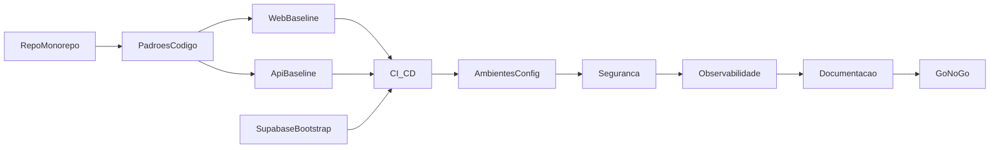

# Plano F1.0 — Fundações do projeto e ambientes

Este documento detalha, em fases bem definidas e exaustivas, os passos para executar com sucesso a F1.0 do MVP “Order Management & Supplier Portal” (CIN7-only, Supabase). Está alinhado a `budtrainer/arquitetura.md` e às decisões do `docs/PLANO_FASE1_MVP.md` (idioma en-US, tom profissional; cliente canadense).

Foco: preparar repositório, monorepo, padrões de código/qualidade, ambientes (DEV/STG/PROD), CI/CD, Supabase (RLS, buckets), Edge Functions de esqueleto, logging/observabilidade básica e documentação. Ao final, teremos "hello world" funcional em Web/API/Functions, deployáveis com segurança.

---

## F1.0-A — Repositório e Monorepo

- **Objetivo**: criar a estrutura base do projeto conforme a arquitetura.
- **Etapas (acionáveis)**:
  1. Criar repositório Git (privado) e configurar proteções de branch (`main` protegida, PRs obrigatórios).
  2. Definir Node LTS e gerenciador (ex.: `.nvmrc` ou Volta) e adotar `pnpm` workspaces.
  3. Criar estrutura de pastas conforme `arquitetura.md`:
     - `apps/web/` (Next.js 14)
     - `apps/api/` (Fastify)
     - `packages/domain/`, `packages/shared/`, `packages/cache/`
     - `supabase/{functions,migrations,seed}/`, `infrastructure/{docker,scripts}/`
  4. Configurar `package.json` raiz com workspaces e scripts base (lint, type-check, test, build).
  5. Configurar `tsconfig.base.json` com paths e herança para todos os pacotes/apps.
  6. Criar `.editorconfig` e `.gitignore` (incluindo `.env*`, `node_modules/`, `/.vercel`, `/.supabase`).
- **Entregáveis**:
  - Monorepo com pastas e arquivos iniciais versionados.
  - Scripts de orquestração no `package.json` raiz.
- **Critérios de aceite**:
  - `pnpm install` funciona na raiz e em cada app.
  - `pnpm -w run type-check` e `pnpm -w run lint` executam (mesmo que com regras mínimas).
- **Riscos & Mitigações**:
  - Divergência de paths/aliases → centralizar no `tsconfig.base.json` e usar importações absolutas.
- **Rollback**:
  - Reverter commit inicial; manter branch `bootstrap` isolada até aprovação.

- **Status**: ✅ Concluído (2025-09-22)

---

## F1.0-B — Padrões de Código e Qualidade

- **Objetivo**: padronizar estilo, qualidade e disciplina de commits.
- **Etapas**:
  1. TypeScript `strict: true` em todos os `tsconfig.json`.
  2. ESLint + Prettier (com integração; regra de import order e sem unused vars).
  3. Husky + lint-staged (format/lint em `pre-commit`); commitlint + conventional commits em `commit-msg`.
  4. Documentar princípios de Object Calisthenics (sem enforcement rígido via lint, mas com guia): `docs/DEV_GUIDE_OBJECT_CALISTHENICS.md`.
- **Entregáveis**:
  - `.eslintrc.*`, `.prettierrc`, hooks Husky e `lint-staged` no `package.json`.
  - Guia de desenvolvimento (Object Calisthenics) em `docs/`.
- **Critérios de aceite**:
  - Commits são bloqueados se lint falhar.
  - Regras mínimas de qualidade ativas em toda a codebase.
- **Riscos & Mitigações**:
  - Regras rígidas demais → começar minimalista; endurecer gradativamente.
- **Rollback**:
  - Desabilitar hooks temporariamente (mantendo guia ativo).

- **Status**: ✅ Concluído (2025-09-22)

---

## F1.0-C — Frontend baseline (apps/web)

- **Objetivo**: entregar Next.js 14 com App Router e base de UI en-US.
- **Etapas**:
  1. Bootstrapping do Next.js 14 (TypeScript) com Tailwind CSS.
  2. Criar providers globais: React Query, Toaster/Notifications, ErrorBoundary.
  3. Configurar i18n en-US (strings base) e tema; adicionar página `/` e `/health`.
  4. Configurar `next.config.js` com headers de segurança (CSP mínima, `X-Frame-Options`, etc.) e imagens remotas (se necessário).
  5. Criar layout padrão (navbar lateral prevista, placeholders) respeitando o tom profissional.
- **Entregáveis**:
  - App web executando localmente (`pnpm dev`) com páginas básicas e estilo base.
- **Critérios de aceite**:
  - Lighthouse básico sem erros graves; páginas carregam em <2s local.
- **Riscos & Mitigações**:
  - CSP muito restritiva → iniciar com política permissiva e endurecer em F1.14.
- **Rollback**:
  - Reverter rota/layout; manter somente `/health`.

- **Status**: ✅ Concluído (2025-09-22)

---

## F1.0-D — Backend baseline (apps/api)

- **Objetivo**: Fastify com camada de erros/log e endpoint de saúde.
- **Etapas**:
  1. Inicializar Fastify com `GET /health` e `GET /version`.
  2. Adicionar `GlobalErrorHandler` conforme `arquitetura.md` e logger estruturado (correlation id por request).
  3. Middleware de Auth stub (preparar para RBAC na F1.2) e validação de schema Zod nas rotas.
  4. Esqueleto de pastas: `routes/`, `services/`, `repositories/`, `infra/`.
- **Entregáveis**:
  - Server com build e start (`pnpm --filter api dev`).
- **Critérios de aceite**:
  - `/health` retorna 200 e logs estruturados aparecem.
- **Riscos & Mitigações**:
  - Divergência entre web e api em tipos compartilhados → usar `packages/shared`.
- **Rollback**:
  - Isolar API em branch; manter apenas health route se necessário.

- **Status**: ✅ Concluído (2025-09-23)

---

## F1.0-E — Supabase bootstrap

- **Objetivo**: provisionar projeto e preparar bases (RLS e Storage).
- **Etapas**:
  1. Criar projeto Supabase DEV; habilitar RLS default; configurar acesso via CLI.
  2. Criar buckets Storage `templates/` e `rfqs/` e políticas mínimas (acesso autenticado, signed URLs para público/fornecedor quando aplicável).
  3. Preparar estrutura de migrations (`supabase/migrations/`) e seeds (`supabase/seed/`).
  4. Documentar variáveis de ambiente Supabase no `.env.example` (ver F1.0-H).
- **Entregáveis**:
  - Projeto DEV funcionando e acessível via CLI; buckets criados.
- **Critérios de aceite**:
  - `supabase status` ok; políticas de Storage válidas.
- **Riscos & Mitigações**:
  - Policies incorretas → revisar em F1.14 (Hardening) e manter acesso mínimo nesta fase.
- **Rollback**:
  - Recriar projeto DEV; migrações ainda não aplicadas (somente estrutura).

- **Status**: ✅ Concluído (2025-09-23)

---

## F1.0-F — Edge Functions (stubs)

- **Objetivo**: criar funções básicas com contrato estável para evoluir nas próximas fases.
- **Etapas**:
  1. Criar `supabase/functions/sync-cin7-stock` (stub: valida payload, loga e retorna 200 com `results: []`).
  2. Criar `supabase/functions/invoice-ocr-extract` (stub: recebe arquivo/URL, retorna `parsed_json: {}` e `ai_flags: []`).
  3. Adicionar log estruturado e tratamento de erro básico em ambas.
- **Entregáveis**:
  - Duas Edge Functions deployáveis (`supabase functions deploy`).
- **Critérios de aceite**:
  - Invocação local e via HTTP responde 200 e loga contexto.
- **Riscos & Mitigações**:
  - Permissões/segredos ausentes → usar Supabase Secrets/Vault (ver F1.0-H) e restringir invocação a internos inicialmente.
- **Rollback**:
  - Reverter deploy; manter diretórios e testes locais.

- **Status**: ✅ Concluído (2025-09-23)

---

## F1.0-G — CI/CD

- **Objetivo**: pipeline confiável para testes e deploys não disruptivos.
- **Etapas**:
  1. Workflow `test`: checkout → setup node → `pnpm i` → `pnpm -w run test` → `type-check` → `lint`.
  2. Workflow `deploy-functions` (prod único): `supabase functions deploy` (stubs) e `supabase db push` opcional se houver migrations e senha configurada.
  3. Workflow `deploy-web` (prod único): build remoto via Vercel CLI (`vercel --prod`) no diretório `apps/web/`.
  4. Branch protection básica para `main` exigindo status `CI` verde.
- **Entregáveis**:
  - `.github/workflows/deploy.yml` e secrets necessários (ver F1.0-H).
- **Critérios de aceite**:
  - Execução verde do job `test`; deploys disparáveis manualmente (apenas `prod`).
- **Riscos & Mitigações**:
  - `db push` sem migrations → condicionar etapa para evitar erros.
- **Rollback**:
  - Desabilitar jobs de deploy; manter somente testes.

---

## F1.0-H — Ambientes e Configuração (.env / Secrets)

- **Objetivo**: padronizar variáveis e gerenciamento seguro de segredos.
- **Etapas**:
  1. Criar `.env.example` na raiz e em `apps/web` e `apps/api` com chaves:
     - Web: `NEXT_PUBLIC_SUPABASE_URL`, `NEXT_PUBLIC_SUPABASE_ANON_KEY`.
     - API: `SUPABASE_URL`, `SUPABASE_SERVICE_ROLE`, `LOG_LEVEL`, `CIN7_API_BASE`.
     - Comum: `APP_ENV` (`dev|stg|prod`), `APP_NAME`, `TZ`.
  2. Configurar Secrets no GitHub, Vercel e Supabase (Vault) — ex.: `CIN7_API_KEY`, `EMAIL_PROVIDER_KEY`.
  3. Definir convenção de nomes e rotinas de rotação de chaves.
- **Entregáveis**:
  - `.env.example` publicados; secrets cadastrados nos provedores.
- **Critérios de aceite**:
  - Apps sobem local com `.env` preenchido; CI usa Secrets sem vazar logs.
- **Riscos & Mitigações**:
  - Vazar secret em log → mascaramento obrigatório e revisão de logs em CI.
- **Rollback**:
  - Revogar chaves e recriar secrets.

---

## F1.0-I — Segurança baseline

- **Objetivo**: estabelecer fundamentos de segurança desde o início.
- **Etapas**:
  1. Ativar RLS por padrão no Supabase (já coberto em F1.0-E) e revisar Storage policies iniciais.
  2. Configurar headers mínimos de segurança no Next.js e Fastify.
  3. Habilitar Secret Scanning e Dependabot (ou Renovate) no GitHub.
- **Entregáveis**:
  - Policies iniciais documentadas; headers ativos; scanners ligados.
- **Critérios de aceite**:
  - Verificação manual com checklists (CSP presente, RLS ativo, secrets scan ativo).
- **Riscos & Mitigações**:
  - False positives de scanners → ajustar configurações e ignore lists.
- **Rollback**:
  - Reverter regras específicas mantendo baseline.

---

## F1.0-J — Observabilidade baseline

- **Objetivo**: logs estruturados e métricas iniciais.
- **Etapas**:
  1. Implementar `StructuredLogger` (conforme `arquitetura.md`) em API e Functions.
  2. Incluir `requestId`/correlation id e tempos de resposta nos logs.
  3. Preparar `MetricsCollector` básico (contadores cache hit/miss, latência de endpoints) — armazenamento local/logs nesta fase.
- **Entregáveis**:
  - Logs estruturados em execução local e em deploys.
- **Critérios de aceite**:
  - Presença de logs com `level`, `timestamp` e contexto em ações chave.
- **Riscos & Mitigações**:
  - Excesso de log → definir níveis por ambiente (`LOG_LEVEL`).
- **Rollback**:
  - Reduzir nível para `error` apenas.

---

## F1.0-K — Documentação, linguagem e comunicação

- **Objetivo**: material mínimo para execução fluida e consistente.
- **Etapas**:
  1. Criar `README.md` (visão, stack, como rodar, como deployar).
  2. Criar `CONTRIBUTING.md` (fluxo de PRs, convenções de commit, revisão de código).
  3. Criar `docs/STYLE_GUIDE_EN_US.md` (tom profissional, terminologia, padrões de UI e e-mails) e iniciar `docs/email-templates/` (modelos base de RFQ enviada e cotação recebida, em inglês).
  4. Adicionar `CODEOWNERS` e template de PR.
- **Entregáveis**:
  - Documentos publicados e versionados.
- **Critérios de aceite**:
  - Time consegue seguir guias e produzir PRs consistentes.
- **Riscos & Mitigações**:
  - Desalinhamento de tom → revisão de conteúdo por quem atende o cliente.
- **Rollback**:
  - Ajustar guias sem impacto técnico.

---

## F1.0-L — Go/No-Go, Checklist final e Rollback

- **Objetivo**: validar que todos os itens da F1.0 estão prontos para suportar F1.1+.
- **Checklist de Go**:
  - Monorepo pronto e scripts raiz funcionam.
  - Web e API sobem localmente e possuem `/health` operacionais.
  - Edge Functions (stubs) deployadas e invocáveis (HTTP) com logs estruturados.
  - Supabase DEV com RLS ativo e buckets `templates/` e `rfqs/` disponíveis.
  - CI `test` verde; pipelines de deploy configuradas (com gates).
  - Secrets populados em provedores; `.env.example` completo.
  - Documentação en-US e guias criados (UI/e-mails/estilo).
- **Aceite final**: responsável técnico assina “Go” e cria tag `f1.0-done`.
- **Plano de Rollback**:
  - Desabilitar jobs de deploy; revogar secrets sensíveis.
  - Manter apenas servidores de `health` e funções stubs; remover DNS se configurado.

---

## Dependências e Sequência sugerida dentro da F1.0

---

## Observações finais

- Este plano segue os princípios de simplicidade robusta, Object Calisthenics e cache/observabilidade descritos em `arquitetura.md`.
- Idioma padrão do produto: inglês (en-US), tom profissional. Todo conteúdo público/externo deve seguir `docs/STYLE_GUIDE_EN_US.md`.
