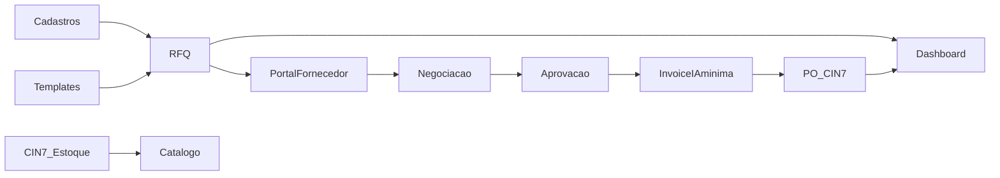

# Plano Fase 1 — MVP (CIN7-only, Supabase)

Este documento detalha, em alto nível porém de forma exaustiva, o plano de execução da Fase 1 — MVP do sistema “Order Management & Supplier Portal”, tomando como base o `arquitetura.md` e alinhado ao PRD `prd_order_management_supplier_portal_cin_7_only_supabase.md`.

- Stack: Next.js 14 (App Router), TypeScript, Tailwind, React Query, Zod; Fastify (API), Supabase (Auth, Postgres, Storage, Edge Functions), CIN7 como única integração externa.
- Princípios: simplicidade robusta, Object Calisthenics, cache inteligente, RLS estrito.
- Tráfego alvo: baixo (<100 req/mês), poucos usuários internos e fornecedores convidados.

- Idioma e tom: inglês (en-US), tom profissional; cliente canadense. Todos os textos de UI, e-mails e documentação externa seguirão esse padrão.

Observação sobre escopo: o `arquitetura.md` posiciona “IA de validação de Invoices” avançada e “QA workflow” na Fase 2. No entanto, no MVP incluiremos um recorte mínimo de IA para invoice: OCR/extração de campos essenciais e regras simples de validação (divergência de preço unitário %, moeda divergente, quantidade acima da aprovada e campos obrigatórios ausentes), gerando flags para apoio à revisão. A validação humana permanece obrigatória. Evoluções avançadas (LLM, diffs detalhados e scoring) ficam para a Fase 2.

---

## 1) Escopo funcional da Fase 1 (MVP)

Cobertura (conforme PRD):
- Catálogo de SKUs com estoque realtime do CIN7 (cache 10 min).
- Cadastros: Vendors, SKU↔Vendor, Templates (Storage) — mínimos para RFQ.
- RFQ: criar/enviar para 1+ vendors, faixas de quantidade, status/timeline, reenvio/cancelamento.
- Portal do Fornecedor: magic link/senha, submissão de cotação (preço por faixa, datas, observações, anexos).
- Negociação & Aprovação: thread básica, aprovar cotação (imutabilidade pós-approval).
- Invoice com IA mínima + Integração CIN7: upload de invoice, OCR/extração mínima com regras (divergência %, moeda, qty > aprovado, campos obrigatórios), flags de apoio à decisão, validação humana e criação/atualização de Purchase Order no CIN7 com anexos.
- Dashboard básico: lista por status, filtros essenciais, link para detalhe.
- Notificações mínimas: e-mail de RFQ enviada e cotação recebida.
- Auditoria mínima: atividades principais (criação RFQ, envio, resposta, aprovação, criação de PO).

Fora de escopo nesta fase (endereçado na Fase 2):
- IA avançada de pré-validação de Invoice (LLM, diffs aprofundados e score).
- QA workflow completo e KPIs avançados.
- Webhooks CIN7 (usaremos polling/edge ou on-demand). 

---

## 2) Sequência de fases ( F1.0 → F1.15 )

A sequência foi desenhada para minimizar retrabalho, reduzir riscos e habilitar testes cedo.

### F1.0 — Fundações do projeto e ambientes
- Objetivo: base do monorepo, padrões, ambientes e variáveis.
- Entregáveis:
  - Estrutura `apps/web` (Next.js) e `apps/api` (Fastify), `supabase/` (migrations, functions), `packages/` (domain/shared/cache), conforme `arquitetura.md`.
  - Pipelines CI: lint, type-check, testes, build; deploy web (Vercel) e funções Supabase.
  - Supabase: projeto criado, RLS habilitado por padrão; buckets iniciais (`templates/`, `rfqs/`).
  - Gestão de segredos (CIN7 keys) no Supabase (Config/Secrets/Vault) e Vercel.
  - Guia de linguagem e copy en-US (tom profissional, cliente canadense): padrões de UI, terminologia e templates de e-mail base.
- Critérios de aceite: deploy hello-world web/API; migrations aplicam em DEV sem erro; buckets acessíveis.
- Riscos/Mitigação: variáveis faltantes → checklists em CI; feature flags para módulos.
- Rollback: revert PR, desabilitar rotas/flags.

### F1.1 — Modelagem de dados e RLS (núcleo)
- Objetivo: criar tabelas, chaves e políticas iniciais.
- Entregáveis (tabelas principais): `users`, `vendors`, `skus`, `sku_vendors`, `sku_vendor_files`, `rfqs`, `rfq_vendors`, `rfq_vendor_quotes`, `threads`, `thread_messages`, `invoices`, `purchase_orders`, `purchase_order_lines`, `activities`.
- RLS/Policies: acesso de `vendor` restrito ao próprio escopo via `vendor_id` no JWT; políticas para `rfqs`, `rfq_vendors`, `thread_messages`, `purchase_orders` (somente leitura do que é seu), conforme exemplos do `arquitetura.md`.
- Índices essenciais: `idx_rfqs_sku_status`, `idx_rfq_vendors_status`, `idx_activities_entity`.
- Critérios de aceite: RLS bloqueia acessos cruzados; CRUD interno funcional; seeds mínimos de teste.
- Rollback: migração reversível; policies atrás de feature flag.

### F1.2 — Auth & RBAC (interno e fornecedor)
- Objetivo: autenticação e perfis por papel (Admin, Buyer, AP/Financeiro, Leitor, Vendor).
- Entregáveis:
  - Supabase Auth (e-mail/senha para internos; magic link para vendors).
  - Emissão de JWT contendo `role` e `vendor_id` (quando aplicável).
  - Guardas client-side e middleware no API.
- Critérios de aceite: fluxo de login e proteção de rotas; vendor enxerga apenas suas RFQs.
- Rollback: desativar convite vendor e rotas do portal.

### F1.3 — Storage e templates por SKU→Vendor
- Objetivo: padronizar anexos e templates.
- Entregáveis: buckets configurados, upload gerenciado com Signed URLs; UI básica para gerenciar `sku_vendor_files` (versão, tipo).
- Critérios: Admin adiciona/remove template e o fornecedor recebe na RFQ.
- Rollback: esconder UI e manter dados.

### F1.4 — Integração CIN7 (estoque) + Cache de estoque
- Objetivo: consulta de estoque por SKU com cache TTL 10 min.
- Entregáveis: `Edge Function` para `getSkuStock` (backoff e ratelimiting), chaves no Vault, cache warming opcional.
- Critérios: Catálogo exibe estoque em ≤2s após CIN7 responder; cache hit/miss logados.
- Riscos: limites de API CIN7 → cache e retries.

### F1.5 — Cadastros (Admin)
- Objetivo: CRUD de Vendors, SKUs, relação SKU↔Vendor.
- Entregáveis: telas com validação (Zod), paginação/filtros; mínimo viável para RFQ.
- Critérios: Admin consegue cadastrar fornecedores e vinculá-los a SKUs; salvar condições padrão (MOQ/lead time).

### F1.6 — Catálogo de SKUs
- Objetivo: listar/buscar SKUs com estoque e ação “Gerar RFQ”.
- Entregáveis: grid, drawer de detalhes, botão de RFQ; integração com cache de estoque.
- Critérios: busca por código/descrição/família; ação “Gerar RFQ” leva ao form.

### F1.7 — RFQ: criação, envio e timeline
- Objetivo: RFQ com faixas de quantidade e anexos.
- Entregáveis: formulário (fornecedores sugeridos, faixas, deadline, anexos do Storage), review e envio; convite via e-mail (magic link com expiração configurável).
- Critérios: registro de eventos (enviado, prazo); reenvio/cancelamento.

### F1.8 — Portal do Fornecedor: cotação
- Objetivo: fornecedor submete cotação.
- Entregáveis: tela com preços por faixa, datas, observações, upload; validações; histórico básico.
- Critérios: submissão muda status para “Cotação recebida” com timestamps; visível internamente.

### F1.9 — Negociação & Aprovação
- Objetivo: comparar cotações, negociar e aprovar.
- Entregáveis: comparativo por faixa; thread básica (interno↔fornecedor); ação “Aprovar cotação” com imutabilidade e notificação.
- Critérios: histórico auditável; reabertura de negociação cria nova rodada.

### F1.10 — Invoice (IA mínima + validação humana) & PO no CIN7
- Objetivo: OCR/extração mínima + regras básicas (divergência %, moeda, qty > aprovado, campos obrigatórios); validação humana e criação/atualização de PO no CIN7.
- Entregáveis: upload de invoice (arquivo armazenado), extração automática de campos essenciais, exibição de flags de divergência, revisão/ajuste humano dos campos, botão “Criar/Atualizar PO no CIN7”, anexar invoice à PO.
- Critérios: PO criada/atualizada com linhas (SKU, qty, unit price) e invoice anexada; flags registradas em `invoices.ai_flags` e visíveis no histórico; status local atualizado.
- Observação: IA avançada (LLM, diffs detalhados e score) permanece na Fase 2.

### F1.11 — Dashboard básico
- Objetivo: visão operacional por status.
- Entregáveis: tabela por status (RFQ enviado, aguardando cotação, cotação recebida, negociação, aprovada, invoice pendente, PO criada); filtros essenciais (SKU, fornecedor, status, prazo).
- Critérios: clique leva ao detalhe.

### F1.12 — Notificações mínimas
- Objetivo: e-mails essenciais para andamento do processo.
- Entregáveis: disparos para RFQ enviada, cotação recebida e aprovação; templates de e-mail em inglês (en-US); preferências simples por usuário (on/off).
- Critérios: logs em `activities` + sucesso de envio.

### F1.13 — Auditoria & Logs (mínimos)
- Objetivo: rastreabilidade das ações críticas.
- Entregáveis: tabela `activities` integrada; logs estruturados no API e Edge Functions; exportação CSV por período (básico).
- Critérios: eventos principais registrados com actor e timestamp.

### F1.14 — Hardening (Segurança, Performance)
- Objetivo: endurecer RLS, revisar políticas e limites.
- Entregáveis: revisão das policies por tabela; limites de payload/upload; headers de segurança; verificação de autorização no API/Edge; testes de permissão vendor.
- Critérios: checklists de segurança passam em DEV e STG.

### F1.15 — Testes, UAT, Cutover e Go-live
- Objetivo: qualidade e transição suave.
- Entregáveis: smoke/end-to-end de fluxos críticos; plano de UAT com dados reais; checklist de go-live; plano de rollback (feature flags desativáveis, scripts de reversão de migration se necessário).
- Critérios: checklist 100% aprovado antes do deploy em PROD.

---

## 3) Plano técnico por domínio

### 3.1 Dados & Migrações (Supabase/Postgres)
- Tabelas conforme seção F1.1; triggers opcionais para `activities`.
- `invoices`: campos `vendor_invoice_number`, `file_path`, `parsed_json`, `ai_flags`, `ai_score`, `status` (em_validacao/aprovada/reprovada), `rfq_vendor_id` (FK).
- Versionamento de migrations em `supabase/migrations/` com scripts reversíveis.
- Seeds mínimos: 1 SKU, 2 Vendors, 1 SKU↔Vendor, 1 RFQ exemplo.

### 3.2 Segurança (RLS, RBAC)
- JWT com `role` e, para vendors, `vendor_id`.
- Policies por tabela: leitura/escrita segregada para vendors; internos por papel (admin/buyer/ap/leitor).
- Auditoria: `activities` grava CRUD, aprovações e integrações (cin7). 

### 3.3 Integração CIN7
- Estoque: Edge Function `sync-cin7-stock` com cache TTL=600s; circuit breaker e retry/backoff.
- PO: chamada autenticada com mapeamento SKU local↔CIN7; anexos (invoice) após criação.
- OCR/extração (IA mínima): Edge Function `invoice-ocr-extract` para extrair campos essenciais e popular `invoices.parsed_json` + `invoices.ai_flags`; fallback manual quando falhar.
- Resiliência: estado “Erro de integração” com “Tentar novamente”; logging de requestId mascare dados sensíveis.

### 3.4 Portal do Fornecedor
- Magic link com expiração (default 7 dias) + opção de definir senha na 1ª visita.
- Escopo de dados 100% restrito ao `vendor_id` do JWT.
- UX mobile-first, validações inline, mensagens claras.

### 3.5 Cache & Performance
- React Query no frontend para dados estáticos/dinâmicos; chaves por entidade.
- Cache near-data: TTLs por entidade (estoque 10 min; vendors 24h; RFQs 5 min; arquivos 7 dias).
- Invalidação seletiva por eventos (ex.: criar RFQ invalida RFQs por SKU).

### 3.6 Observabilidade
- Logs estruturados em API e Edge Functions (níveis info/error com contexto).
- Métricas básicas: cache hit/miss, latência de chamadas CIN7, taxa de erro por endpoint.
- Painel simples (datadog/logflare/supabase logs). 

### 3.7 CI/CD & Ambientes
- GitHub Actions: jobs de test/lint/type-check; deploy `supabase db push` e `supabase functions deploy`; deploy web (Vercel) pós-testes.
- Ambientes: DEV (preview), STG (UAT), PROD (go-live). 

---

## 4) Cronograma sugerido (12 semanas)
- Semanas 1–2: F1.0–F1.2 (Fundações, Dados/RLS, Auth/RBAC)
- Semanas 3–4: F1.3–F1.5 (Storage/Templates, CIN7 estoque, Cadastros)
- Semanas 5–6: F1.6–F1.7 (Catálogo, RFQ criação/envio)
- Semanas 7–8: F1.8–F1.9 (Portal cotação, Negociação/Aprovação)
- Semanas 9–10: F1.10–F1.11 (Invoice com IA mínima + PO CIN7, Dashboard)
- Semana 11: F1.12–F1.13 (Notificações, Auditoria)
- Semana 12: F1.14–F1.15 (Hardening, UAT, Go-live)

---

## 5) Critérios de aceite (E2E para a Fase 1)
1) Criar RFQ para 1 SKU com 2 vendors, enviar convites, ambos submetem cotação; status “Cotação recebida” + timestamps.
2) Negociação registrada em thread; ao aprovar, resposta fica imutável e notificação é enviada.
3) Upload de invoice, extração automática de campos essenciais (OCR) com flags de divergência (preço %, moeda, qty > aprovado, campos obrigatórios), revisão humana e criação/atualização da PO no CIN7 com linha correta (qty/preço), anexando invoice; status atualizado.
4) Catálogo exibe estoque do CIN7 com atualização em ≤2s após resposta (cache ativo). 
5) Dashboard lista por status; clique leva ao detalhe.

---

## 6) Riscos & Mitigações
- Adoção do fornecedor: magic link, mobile-first, anexos grandes, ajuda contextual.
- Latência CIN7: cache + retries/backoff; fallback manual “Tentar novamente”.
- RLS incorreta: testes de permissão automatizados; revisão por tabela; checklists de segurança.
- IA mínima de invoice (OCR/flags) pode falhar ou ter baixa acurácia: fallback manual completo; revisão humana obrigatória; IA avançada (LLM/diffs/score) ficará para a Fase 2.
- Versionamento de templates: campo `versao` em `sku_vendor_files` e aviso ao fornecedor na RFQ.

---

## 7) Divergências PRD × Arquitetura (racional)
- IA de Invoice: PRD sugeria no MVP e o `arquitetura.md` posicionava para a Fase 2. Decisão atual: incluir IA mínima (OCR + regras simples e flags) já no MVP para apoiar a validação humana, mantendo a IA avançada (LLM/diffs/score) para a Fase 2. UI/contratos já preparados para evolução.
- Idioma/UI: PRD indicava pt-BR; decisão atual: inglês (en-US) com tom profissional por ser produto para cliente canadense.

---

## 8) Mapa de cobertura (PRD → Fase 1)
- 4.1 Catálogo: Coberto (F1.6 + F1.4).
- 4.2 Cadastros: Coberto (F1.5 + F1.3).
- 4.3 RFQ: Coberto (F1.7).
- 4.4 Portal do Fornecedor: Coberto (F1.8).
- 4.5 Negociação & Aprovação: Coberto (F1.9).
- 4.6 Invoice & PO: Coberto no MVP com IA mínima (F1.10); IA avançada na Fase 2.
- 4.7 Dashboard: Coberto (básico) (F1.11).
- 4.8 Notificações & SLAs: Parcial (mínimas) (F1.12).
- 4.9 Auditoria & Logs: Coberto (mínimo) (F1.13).
- 5) Integração CIN7: Coberta (estoque + PO) (F1.4, F1.10).

---

## 9) Fluxo de dependências (alto nível)

---

## 10) Definição de pronto (DoD) por fase
- Código tipado e lintado; testes básicos passam; logs estruturados; RLS revisada; documentação mínima (README da feature); feature flags quando aplicável; migrações reversíveis; checklist de segurança aplicado.

---

## 11) Próximos passos após o MVP (ponte para Fase 2)
- IA de pré-validação de Invoice (OCR/LLM, flags e score), tela split-view com diffs.
- QA workflow integrado (upload, anexar na PO e status).
- KPIs avançados; webhooks CIN7; notificações push; menções internas; multi-SKU por RFQ.

---

Documento de referência: `budtrainer/arquitetura.md` e `budtrainer/prd_order_management_supplier_portal_cin_7_only_supabase.md`.
